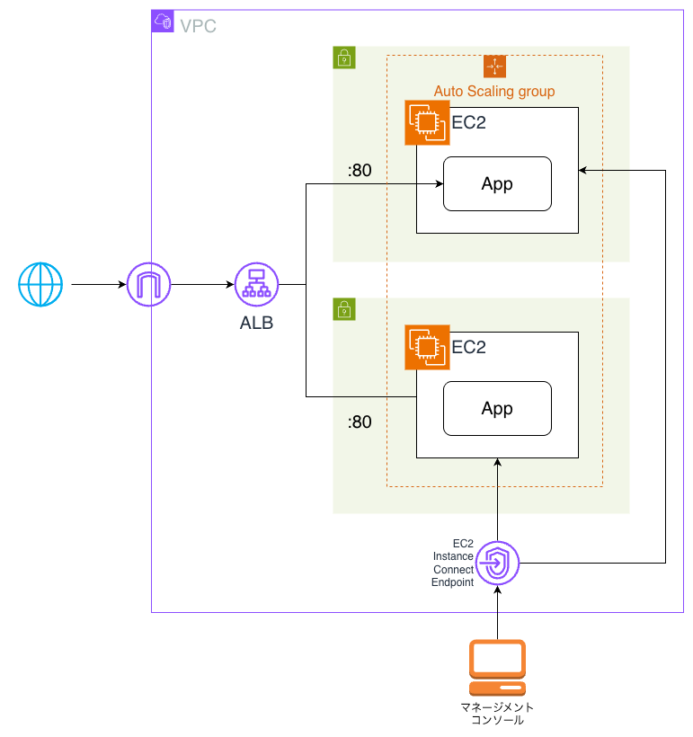

# terraform-codedeploy-sample

このリポジトリは、AWS CodeDeploy のチュートリアルで使うための、デプロイ先AutoScaling環境を Terraform で作るためのものです。

注意: CodeDeploy の設定やデプロイするアプリケーションの設定は別途必要です。

注意: EC2 単体構成の場合は、`main` ブランチを参照してください。

## このリポジトリで作るもの

- VPC（Internet Gateway / Route Table / Public Subnet x 2）
- Application Load Balancer
- Target Group / Listener
- Launch Template
- Auto Scaling Group
- EC2 Instance Connect Endpoint
- セキュリティグループ



## 接続

- ブラウザで、インターネット側から ALB の 80 番ポートにアクセス可能
- AWS マネジメントコンソールで、EC2 Instance Connect 経由で EC2 インスタンスにログイン可能

## 変数

初期値を変えたいときは、次の変数を `tfvars` 等で上書きします。

- `aws_region`
- `project_name`
- `vpc_cidr`
- `public_subnet_cidr`
- `public_subnet_secondary_cidr`
- `instance_type`
- `autoscaling_min_size`
- `autoscaling_max_size`
- `autoscaling_desired_capacity`

## 使い方

```bash
terraform init
terraform plan
terraform apply
terraform destroy
```
